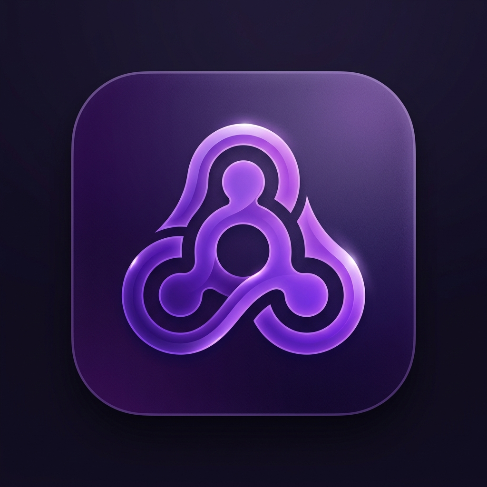

# CivicNet - Community Help Network

<div align="center">
  
  <h3>Connect. Help. Build Community.</h3>
</div>

---

## 🌟 Overview

**CivicNet** is a futuristic, AI-powered platform designed to connect people who need help with neighbors who can provide it. Whether it's a leaky faucet, emergency tech support, or moving heavy furniture, CivicNet intelligently matches requests to local helpers.

Designed with a stunning **dark-mode-first aesthetic**, smooth micro-animations, and hyper-responsive UI, CivicNet delivers a premium mobile experience while solving real-world community problems.

---

## ✨ Key Features

### 🚀 Smart AI Matching
CivicNet doesn't just list tasks; it actively finds the best people for the job. Our algorithm calculates an `AI Relevance Score` based on:
- **Proximity:** Built-in GPS checks the exact distance between the requester and helper.
- **Skillset Match:** Compares a helper's verified skills against the request's category and description.
- **Urgency Level:** Prioritizes critical/emergency tasks.

### 📍 Real-Time Geolocation & Maps
Integrated with Google Maps and Flutter Map, CivicNet visualizes help requests on an interactive map. You can see real-time distance calculations using the **Haversine formula** to find nearby tasks instantly.

### 🎨 Liquid Glass UI
The app features a custom "Liquid Glass" design system:
- **Adaptive Theming:** Deep purples and neon accents (`#7B61FF`) create a modern, trust-building environment.
- **Sliver Animations:** Collapsing app bars with smooth cross-fades and parallax Hero banners.
- **Cross-Platform Adaptiveness:** Native Cupertino dialogs and bottom sheets on iOS/macOS, and sleek Material overlays on Android/Web.

### 💬 Secure Real-time Messaging
Powered by Supabase, the chat system allows requesters and matched helpers to communicate privately.
- Secure, instant messaging.
- Chat only unlocks *after* a helper is officially accepted to protect user privacy.

### 🔔 Push Notifications
Integrated with **Firebase Cloud Messaging (FCM)**, users receive instant alerts when:
- Someone applies to help with their request.
- A request is updated or resolved.
- Support is urgently needed nearby.

### 🛡️ Privacy & Moderation
- **Hidden Locations:** Exact addresses are never shown publicly; only rough distance estimates are provided before acceptance.
- **Reporting System:** Built-in community moderation. Accounts with multiple violation reports receive automatic warnings and bans.

---

## 🛠️ Tech Stack & Architecture

- **Framework:** Flutter (Mobile, Web, Desktop)
- **Backend / Database:** [Supabase](https://supabase.com) (PostgreSQL, Authentication, Realtime)
- **State Management:** Provider & Custom Services (Singletons)
- **Local Storage / Caching:** Hive & SharedPreferences
- **Push Notifications:** Firebase Cloud Messaging (FCM)
- **Crash Reporting:** Firebase Crashlytics
- **Location:** Geolocator (GPS tracking & permission handling)

---

## 📱 How It Works (User Journey)

### 1. The Requester
1. **Create a Request:** Tap the floating Action Button.
2. **Auto-Categorize:** Type your issue (e.g., "My pipe burst!"), and AI auto-categorizes it as an *Emergency*.
3. **Wait for Matches:** The request goes live on the local feed and map.
4. **Accept Help:** Review applications from verified helpers, check their Match Score, and accept the best fit.
5. **Chat & Resolve:** A secure chat channel opens. Once the job is done, mark it as resolved.

### 2. The Helper
1. **Setup Profile:** Add your skills (e.g., *Plumbing, IT Support*) via the Profile Screen.
2. **Browse Feed:** View tasks nearby sorted by your personalized Match Score.
3. **Apply:** Offer your help with one tap.
4. **Get Approved:** Wait for the requester to accept.
5. **Communicate:** Coordinate arrival via the secure chat.

---

## 💻 Running the App

### Requirements
- Flutter SDK `3.19.0` or higher
- Dart `3.3.0` or higher
- Xcode (for iOS/macOS) / Android Studio (for Android)

### Setup Steps
1. **Clone the repository:**
   ```bash
   https://github.com/sufyankamil/ai-civicnet.git
   cd ai-civicnet
   ```

2. **Install dependencies:**
   ```bash
   flutter pub get
   ```

3. **Run Code Generation (Optional, for models/Freezed if used):**
   ```bash
   flutter pub run build_runner build --delete-conflicting-outputs
   ```

4. **Run the App:**
   ```bash
   flutter run
   ```

*(Note: Supabase API keys are securely managed within the `StartupService`. No external `.env` setup is required for basic testing).*

---

## 🧪 Testing and Quality Assurance
CivicNet maintains a strict **zero-warning policy**.
- **Code Quality:** Verified via `flutter analyze`. The codebase is 100% free of warnings, deprecation notices, and hints.
- **Crash Free:** Handled globally by Firebase Crashlytics to ensure high uptime.

## App Store
https://apps.apple.com/app/id6761416586

### App encryption documentation

Public summary of chat crypto: [`docs/app-store/civicnet-encryption-declaration.md`](docs/app-store/civicnet-encryption-declaration.md).

For App Store Connect: print [`docs/app-store/civicnet-encryption-declaration.html`](docs/app-store/civicnet-encryption-declaration.html) to PDF locally and upload it (steps: [`docs/app-store/APP_STORE_ENCRYPTION.md`](docs/app-store/APP_STORE_ENCRYPTION.md)). The PDF is gitignored. After Apple approves:

```bash
bash scripts/set_encryption_compliance_code.sh YOUR_APPLE_CODE
```

`ITSAppUsesNonExemptEncryption` is already `true` in `ios/Runner/Info.plist`.

## TestFlight CI

Merges to `main` only run **`flutter analyze`** (workflow: **Flutter CI**). They do **not** upload to TestFlight automatically.

To ship a TestFlight build when you’re ready:

1. Merge your work to `main` (analyze should be green).
2. GitHub → **Actions** → **TestFlight Upload** → **Run workflow**.
3. Wait for the build; check App Store Connect → TestFlight.

### One-time Apple setup

1. In [App Store Connect](https://appstoreconnect.apple.com/access/integrations/api), create an API key (App Manager or Admin), download the `.p8`, and note the **Key ID** and **Issuer ID**.
2. In Keychain Access, export your **Apple Distribution** certificate as a `.p12` (set a password).
3. In [Apple Developer Profiles](https://developer.apple.com/account/resources/profiles/list), download the **App Store** provisioning profile for `com.sufyankamil.communityNet` (must include that Distribution cert).
4. Drop the `.p8`, `.p12`, and `.mobileprovision` into `secrets_inbox/`, then run:

```bash
bash scripts/encode_testflight_secrets.sh
```

Paste each file under `secrets_inbox/encoded/*.txt` into the matching GitHub secret (folder is gitignored).

5. Add these GitHub Actions secrets ([repo secrets](https://github.com/sufyankamil/ai-civicnet/settings/secrets/actions)):

| Secret | Value |
|--------|--------|
| `BUILD_CERTIFICATE_BASE64` | Base64 of Distribution `.p12` |
| `P12_PASSWORD` | Password used when exporting the `.p12` |
| `BUILD_PROVISION_PROFILE_BASE64` | Base64 of App Store `.mobileprovision` |
| `KEYCHAIN_PASSWORD` | Any strong password for the temporary CI keychain |
| `APP_STORE_CONNECT_API_KEY_ID` | App Store Connect Key ID |
| `APP_STORE_CONNECT_ISSUER_ID` | App Store Connect Issuer ID |
| `APP_STORE_CONNECT_API_KEY_BASE64` | Base64 of the `.p8` key |
| `GOOGLE_SERVICE_INFO_PLIST_BASE64` | Base64 of `ios/GoogleService-Info.plist` |
| `SUPABASE_URL` / `SUPABASE_ANON_KEY` / `GOOGLE_MAPS_API_KEY` | Already used by analyze |

Build name is set automatically to `major.<YYMMDD>.<github.run_number>` (e.g. `1.260805.12`) and build number to `github.run_number`. Uploads skip waiting for Apple processing; check TestFlight in App Store Connect after the workflow succeeds.

## App Store release

Promotes an **already-tested TestFlight build** to App Store review (no rebuild).

**What’s New** is generated automatically from recent git commit messages: CI strips technical wording (file names, CI/chore commits, jargon) and rewrites the rest into short shopper-facing bullets. It also refreshes `CHANGELOG.md` → `## Unreleased`. You do **not** need to edit the changelog by hand before releasing.

### Steps

1. Test the build on TestFlight.
2. In GitHub: **Actions** → **App Store Release** → **Run workflow**.
3. Enter **build number only** — e.g. `73` from `build=73` (not `1.260805.73`).
   Leave **app version** blank unless auto-detect fails; then use `1.260805.73` from `marketing=…`.
4. Review the generated notes in the workflow log, then wait for App Store Connect (**Waiting for Review**).
5. After Apple approves, release manually in App Store Connect (`automatic_release` is off).

Uses the same App Store Connect API key secrets as TestFlight CI.

---
*Built with ❤️ for a better community.*
